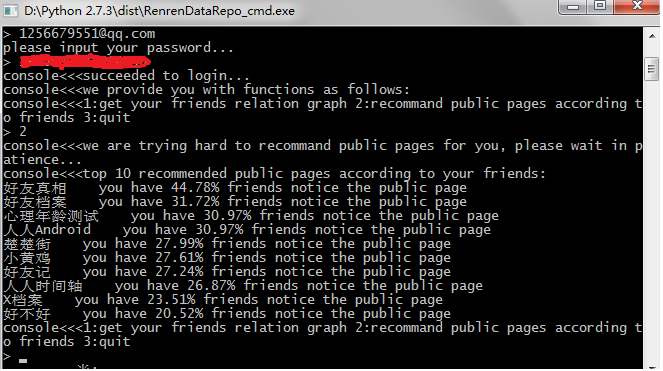
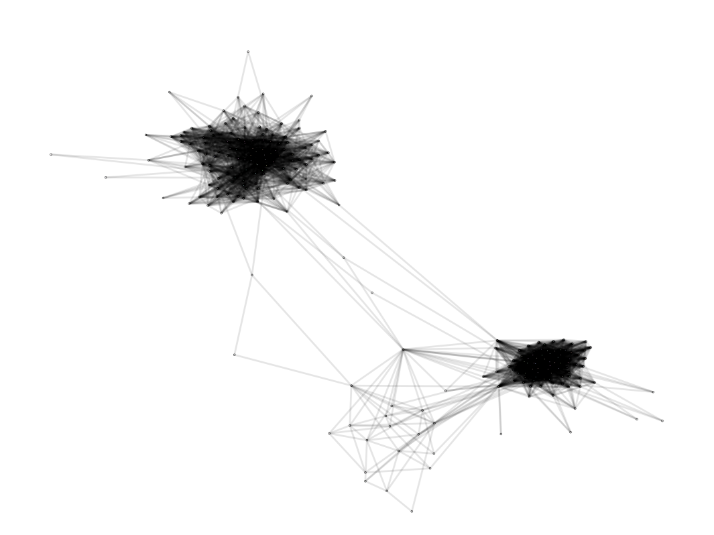

<h2>
<a name="RenrenDataRepo" class="anchor" href="#RenrenDataRepo"></a>RenrenDataRepo</h2>

a renren.com website based user datas capture and analysis project using python.
frends relation graph and public pages recommand...
thanks for help from
<a href="https://github.com/yueyoum/renren-relationship">yueyoum/renren-relationship.</a>

<h2>
<a name="description" class="anchor" href="#description"></a>1 description of the project</h2>

using python to write a script, which can log in the
 <a href="http://www.renren.com"><strong>renren website</strong></a>
and obtain user datas for two purposes:
1 draw a relationship graph 2 recommend public pages

<h2>
<a name="realization" class="anchor" href="#realization"></a>2 realization of the project</h2>

<h3>
<a name="model 1" class="anchor" href="#model-1"></a>2.1 part one: RenrenHandler</h3>

In this part, we use some third part packages such as urllib, httplib2, re and json. Among these packages, urllib and httplib2 are used for log in the website and obtain datas, re is used for
matching strings with regular expression, and json is used for storage of object.

<h3>
<a name="model 2" class="anchor" href="#model-2"></a>2.2 part two: dataVisualizationHandler</h3>

In this part, we use some packages such as RenrenHandler and networkx. Among these packages, RenrenHandler is the user-define package we talked about above,
and networkx is a third part package used for drawing graphs.

<h3>
<a name="model 3" class="anchor" href="#model-3"></a>2.3 part three: dataMiningHandler</h3>

In this part, we use RenrenHandler and recommend public pages with

<a href="http://en.m.wikipedia.org/wiki/K-nearest_neighbors_algorithm"><strong>KNN.</strong></a>

<h2>
<a name="presentation" class="anchor" href="#presentation"></a>3 presentation</h2>
<h3>
	
console
</h3>
&nbsp;&nbsp;&nbsp;&nbsp;</img>
    

<h3>
	
relationship-graph
</h3>
&nbsp;&nbsp;&nbsp;&nbsp;</img>
    